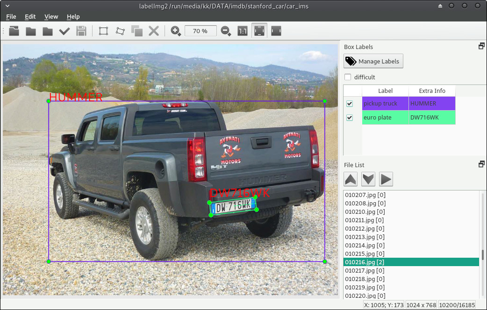

LabelImg2
========

LabelImg2 is a graphical image annotation tool.

It is written in Python and uses Qt for its graphical interface.

Annotations are saved as XML files in PASCAL VOC format, the format used
by `ImageNet <http://www.image-net.org/>`__.

Annotations can now be exported in Ultralytics YOLO's BOX format and OBB format.

Installation
------------------

Build from source
~~~~~~~~~~~~~~~~~

Linux/Ubuntu/Mac requires at least `Python

Ubuntu Linux
^^^^^^^^^^^^

Python 3 + Qt5

.. code::

    sudo apt-get install pyqt5-dev-tools
    sudo pip3 install lxml
    python3 labelImg.py
    python3 labelImg.py [IMAGE_PATH] [PRE-DEFINED CLASS FILE]

Windows + Anaconda
^^^^^^^

Download and install `Anaconda <https://www.anaconda.com/download/#download>`__ (Python 3+)

Open the Anaconda Prompt and go to the `labelImg <#labelimg>`__ directory.
You might need admin privileges to install.

.. code::

    conda install pyqt=5
    python labelImg.py
    python labelImg.py [IMAGE_PATH] [PRE-DEFINED CLASS FILE]

Usage
-----

Steps (PascalVOC)
~~~~~

1. Build and launch using the instructions above.
2. Click 'Change default saved annotation folder' in Menu/File
3. Click 'Open Dir'
4. Click 'Create RectBox'
5. Click and release left mouse to select a region to annotate the rect
   box
6. You can use right mouse to drag the rect box to copy or move it

The annotation will be saved to the folder you specify.

You can refer to the below hotkeys to speed up your workflow.

Create pre-defined classes
~~~~~~~~~~~~~~~~~~~~~~~~~~

You can edit the
`data/predefined\_classes.txt <https://github.com/chinakook/labelImg2/blob/master/data/predefined_classes.txt>`__
to load pre-defined classes

Hotkeys
~~~~~~~

+------------+--------------------------------------------+
| Ctrl + u   | Load all of the images from a directory    |
+------------+--------------------------------------------+
| Ctrl + r   | Change the default annotation target dir   |
+------------+--------------------------------------------+
| Ctrl + s   | Save                                       |
+------------+--------------------------------------------+
| Ctrl + d   | Copy the current label and rect box        |
+------------+--------------------------------------------+
| Space      | Flag the current image as verified         |
+------------+--------------------------------------------+
| w          | Create a rect box                          |
+------------+--------------------------------------------+
| d          | Next image                                 |
+------------+--------------------------------------------+
| a          | Previous image                             |
+------------+--------------------------------------------+
| z          | Rotates counterclockwise, big steps;       |
+------------+--------------------------------------------+
| x          | Rotates counterclockwise, small steps;     |
+------------+--------------------------------------------+
| c          | Rotates clockwise, small steps;            |
+------------+--------------------------------------------+
| v          | Rotates clockwise, big steps.              |
+------------+--------------------------------------------+
| f          | Rotates 90 degrees clockwise.              |
+------------+--------------------------------------------+
| del        | Delete the selected rect box               |
+------------+--------------------------------------------+
| Enter      | Select a rect box                          |
+------------+--------------------------------------------+
| Ctrl++     | Zoom in                                    |
+------------+--------------------------------------------+
| Ctrl--     | Zoom out                                   |
+------------+--------------------------------------------+
| ↑→↓←       | Keyboard arrows to move selected rect box  |
+------------+--------------------------------------------+

How to contribute
~~~~~~~~~~~~~~~~~

Send a pull request

License
~~~~~~~
`Free software: MIT license <https://github.com/chinakook/labelImg2/blob/master/LICENSE>`_

Citation: Chinakook. LabelImg2. Git code (2018-2025). https://github.com/chinakook/labelImg2
